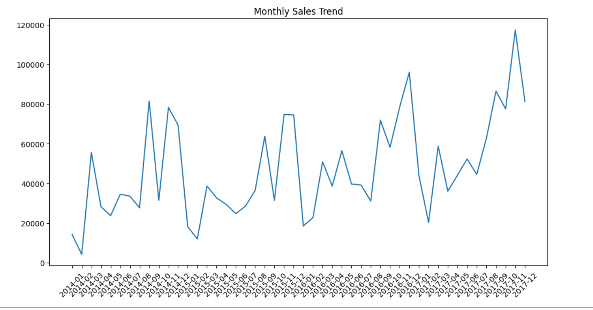
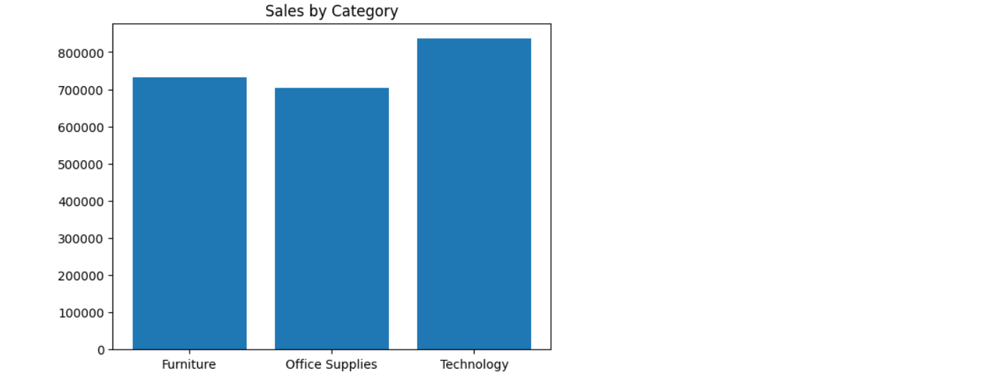

# 📊 End-to-End Retail Data Analysis using SQL and Pandas

## 📌 Overview
This project demonstrates an end-to-end data analysis workflow by combining SQL and Pandas. Data is extracted from a relational database using SQL and further analyzed using Pandas to generate business insights.

## 🛠 Tools & Technologies
- SQL (MySQL)
- Python
- Pandas
- NumPy
- Matplotlib

## 🔄 Workflow
- Data stored in MySQL database
- SQL used for data extraction and aggregation
- Pandas used for data transformation and analysis
- Visualizations created using Matplotlib

## 📊 Analysis Performed

### 🔹 SQL Analysis
- Filtered high sales transactions
- Aggregated sales by category
- Extracted top customers
- Analyzed monthly sales trends

### 🔹 Pandas Analysis
- Data transformation and feature engineering
- Extracted year and month from date
- Customer-level and product-level analysis
- Sales and profit insights

## 🔥 Key Insights
- Technology category contributes highest sales
- Top customers generate significant portion of revenue
- Some products consistently generate losses
- Sales trends vary across months
- Repeat customers play important role in revenue generation

## 🔄 ETL Process
- Extracted data from MySQL database using SQL queries
- Transformed data using Pandas for analysis and feature engineering
- Loaded processed insights for visualization and reporting

├── sql/            # SQL queries used for extraction

## 🧠 Why SQL + Pandas?
- SQL is used for efficient data extraction and aggregation from database
- Pandas is used for advanced analysis, transformation, and visualization
- This combination reflects real-world data analysis workflows

## 📸 Visualizations

### Monthly Sales Trend

### Sales by Category

## 📁 Project Structure
