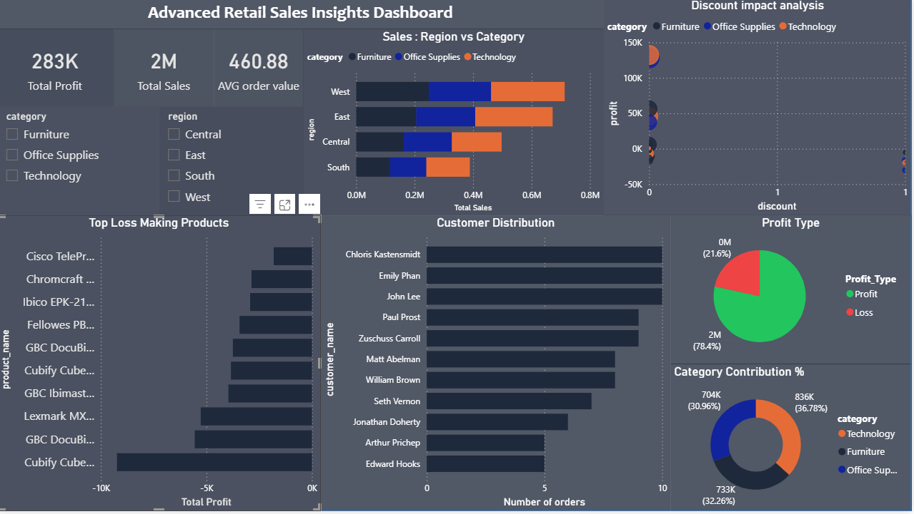

# 📊 End-to-End Retail Data Analysis (SQL + Pandas + Power BI)

---

## 📌 Overview

This project demonstrates a complete end-to-end data analytics workflow by integrating SQL, Pandas, and Power BI. Data is extracted from a relational database using SQL, transformed and analyzed using Pandas, and finally visualized through an interactive Power BI dashboard.

---

## 🎯 Objective

* Perform real-world data analysis using SQL and Python
* Build a complete ETL + analytics pipeline
* Generate actionable business insights
* Develop an advanced interactive dashboard

---

## 🛠 Tools & Technologies

* SQL (MySQL)
* Python
* Pandas
* NumPy
* Matplotlib
* Power BI

---

## 🔄 Workflow

1. **Data Storage**

   * Dataset stored in MySQL database

2. **Data Extraction (SQL)**

   * Used SQL queries for filtering, aggregation, and joins

3. **Data Transformation (Pandas)**

   * Feature engineering (Year, Month, Profit Type)
   * Data cleaning and restructuring

4. **Data Export**

   * Processed datasets exported as CSV files for dashboard

5. **Visualization (Power BI)**

   * Built advanced interactive dashboard

---

## 📊 Analysis Performed

### 🔹 SQL Analysis

* High-value sales transaction filtering
* Category-wise sales aggregation
* Top customer identification
* Monthly sales trend extraction

---

### 🔹 Pandas Analysis

* Data cleaning and preprocessing
* Feature engineering (Year, Month, Profit Type)
* Customer-level and product-level analysis
* Region and category-based insights

---

### 🔹 Advanced Analysis

* Discount vs Profit impact analysis
* Loss-making product identification
* Category contribution percentage
* Region vs Category performance
* Customer distribution patterns

---

## 📈 Power BI Dashboard

An advanced dashboard was created to visualize deeper business insights:

* KPI Cards (Total Sales, Total Profit, Total Orders, Avg Order Value)
* Discount Impact Analysis (Scatter Plot)
* Region vs Category Sales (Stacked Bar)
* Loss-Making Products Analysis
* Customer Distribution
* Profit vs Loss Distribution
* Category Contribution (%)
* Interactive Slicers (Category & Region)

---

### 📸 Dashboard Preview




---

---
## 📸 Visualizations
### Monthly Sales Trend 

### Sales by Category 

---

## 🔥 Key Insights

* Higher discounts often lead to reduced profitability
* Technology category contributes the highest revenue share
* Certain products consistently generate losses and require optimization
* Sales performance varies significantly across regions
* A small group of customers drives a large portion of revenue
* Profitability is not always directly proportional to sales

---

## 🔄 ETL Process

* Extracted data from MySQL using SQL queries
* Transformed and enriched data using Pandas
* Loaded processed datasets into Power BI for visualization


## 📁 Project Structure

```id="pj3x91"
dataset/        → Raw database / CSV files  
notebook/       → Jupyter Notebook (SQL + Pandas analysis)  
outputs/        → Visualizations & dashboard screenshots  
dashboard/      → Power BI dashboard (.pbix file)  
```

---

## 🚀 Key Skills Demonstrated

* SQL Querying & Data Extraction
* Data Cleaning & Feature Engineering
* Exploratory Data Analysis (EDA)
* Business Insight Generation
* Data Modeling Concepts (Power BI)
* Dashboard Development
* End-to-End Data Analytics Workflow

---

## 👨‍💻 Author

**Pankaj Juyal**

